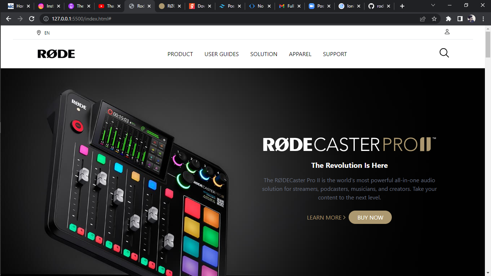
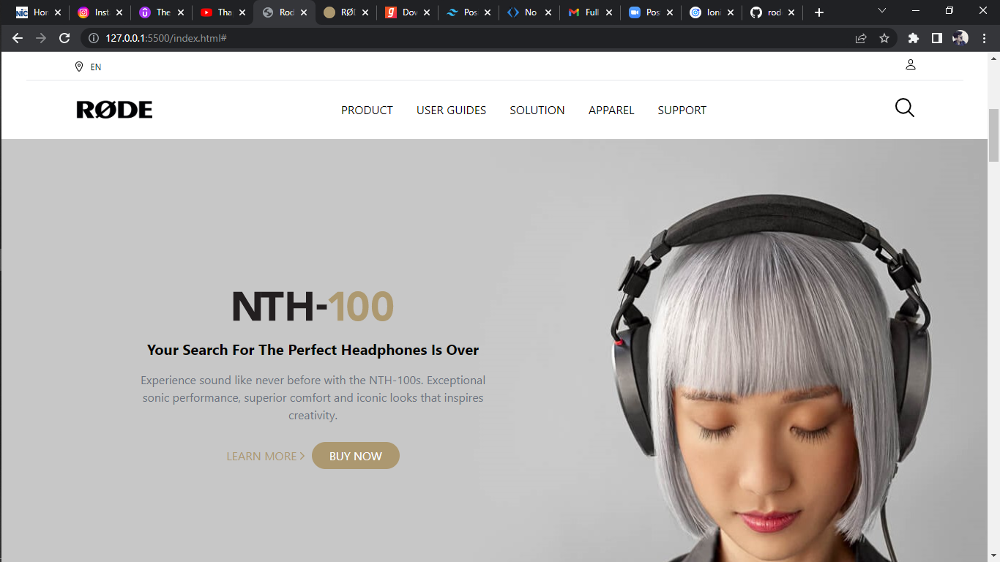
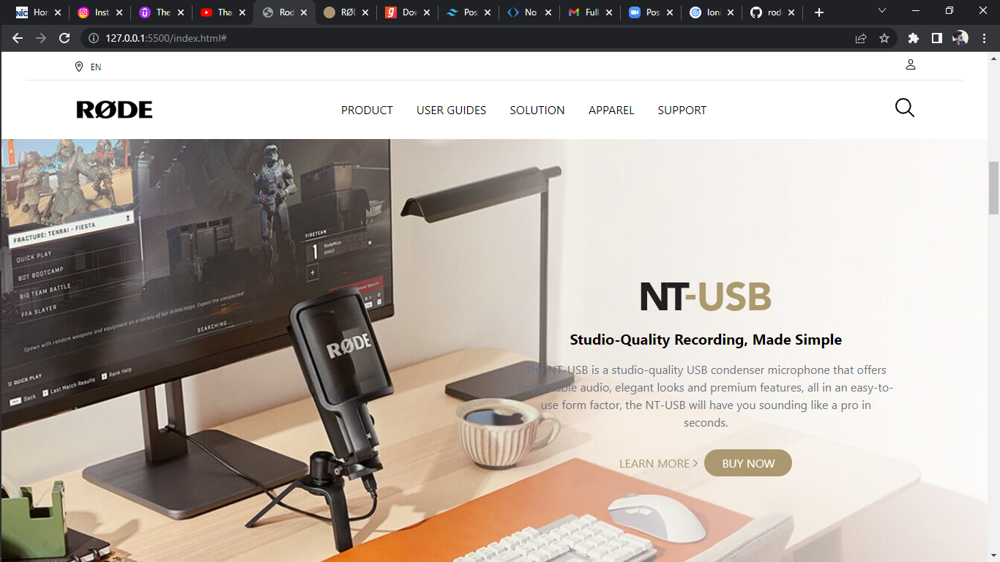
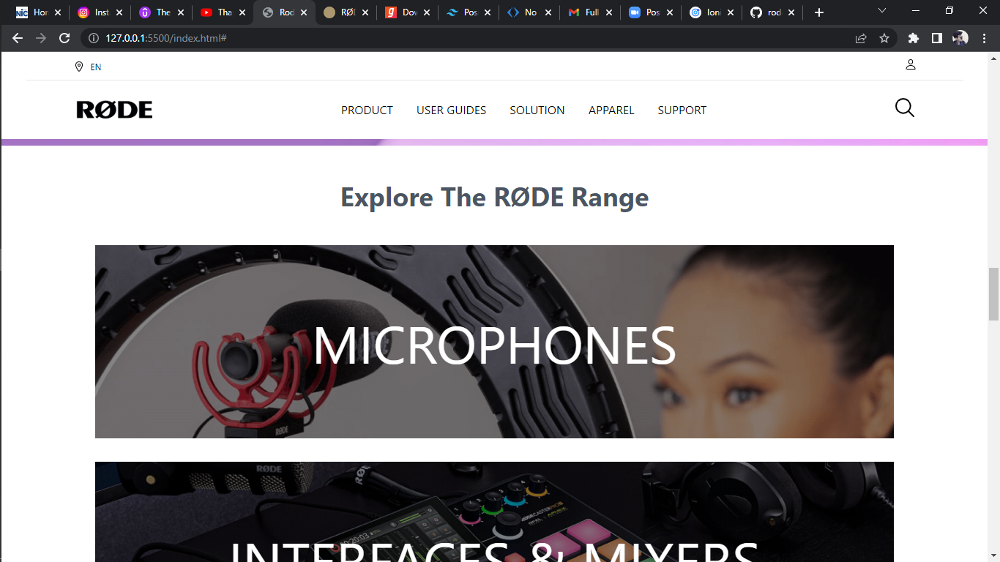

# Rode Clone Website

## Screenshot

## Technologies used?

    - HTML
    - Tailwind CSS

## Time duration to build this project?

    - 12hrs

## How to run ?

    - Download zip file from github or use git to clone project in your computer system.
    - Open downloaded folder and go to index.html file
    - Double click on index.html icon.

## Find me on

 [Shubham Somvanshi](https://www.linkedin.com/in/shubham-somvanshi-778193135/)
